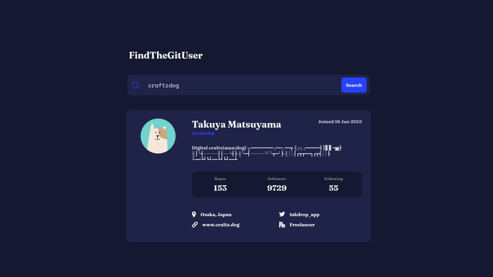

# Devsoc Project - Github-user-search-web-app

This is the 2nd project given by Devsoc Bits Goa.

## Table of contents

- [Overview](#overview)
  - [The challenge](#the-challenge)
  - [Features](#features)
  - [Screenshot](#screenshot)
  - [Links](#links)
- [My process](#my-process)
  - [Built with](#built-with)
  - [What I learned](#what-i-learned)

## Overview

### The challenge

Users should be able to:

- View the optimal layout for the site depending on their device's screen size
- See details of the Github user by using Github username.

### Features

- Responsive to any device.
- It has animation for showing both error statement and userInfo box
- It presents a variety of information about the searched username in a user-friendly format, making it easy for the user to distinguish between available and unavailable details.

### Screenshot

### Links

- [Live Site URL](https://your-live-site-url.com)

## My process

### Built with

- Semantic HTML5 markup
- CSS
- Flexbox
- CSS Grid
- API

### What I learned

This task helped me understand how to fetch data from a server using APIs and display it in a user-friendly way. I also practiced creating responsive websites and learned the importance of minimizing code through functions, as well as the significance of using clear class and ID names. I was also able to explore and learn animation.
